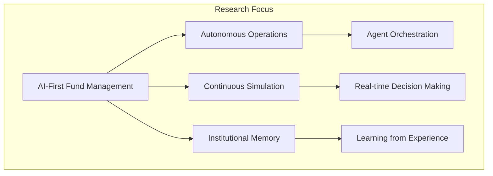
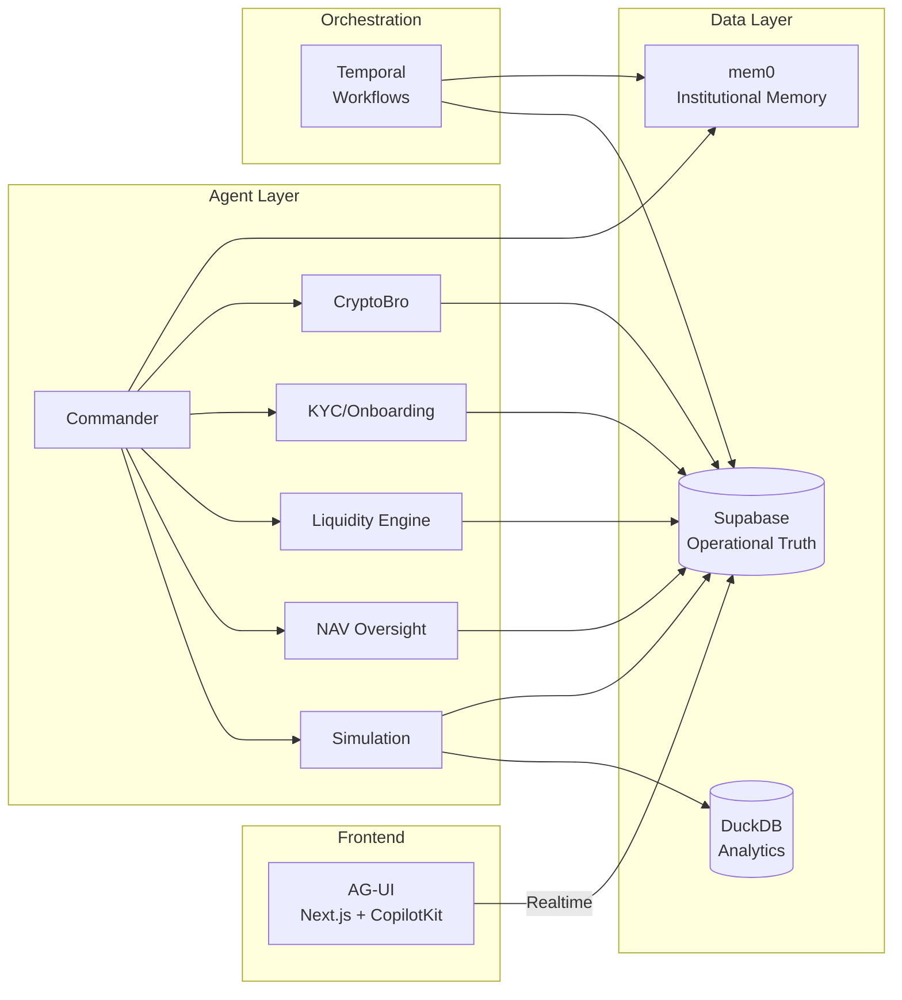
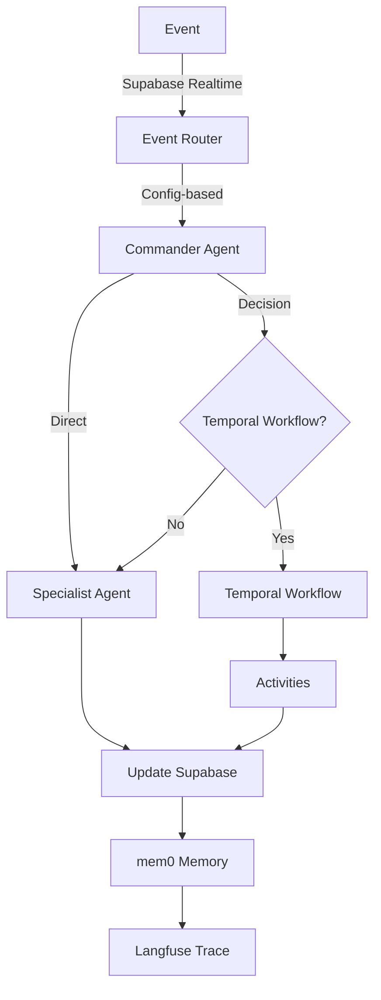

# Evergreen Dragon OS

[](https://github.com/DealExMachina/evergreen-dragon-os)
[](https://opensource.org/licenses/MIT)
[](https://www.typescriptlang.org/)
[](https://nodejs.org/)
[](https://pnpm.io/)

AI-native operating system for evergreen and ELTIF 2.0 fund management. Research platform exploring autonomous fund operations through agent orchestration, temporal workflows, and institutional memory.

## Research Goal

This project investigates how AI-first architectures can transform evergreen fund management by creating a digital twin of fund operations. The system continuously simulates, monitors, and orchestrates portfolio lifecycle events—from asset onboarding through liquidity management to compliance reporting—enabling boutique managers to operate at institutional scale.



## Architecture

The platform is intentionally modular, separating concerns across specialized systems:



## Design Choices

### 1. Modular Architecture
- **Temporal** for durable, auditable workflows
- **Mastra** for agent reasoning and orchestration
- **Supabase** as operational data store and realtime bus
- **DuckDB** for analytical simulations
- **mem0** for institutional memory and knowledge graphs

### 2. Dependency Injection
All agents receive typed `AgentContext` with config, logger, and clients. No global singletons. Activities use `withActivityContext()` for memoized dependencies.

### 3. Event-Driven
Supabase Realtime broadcasts trigger agent responses. Event routing configured via `config.agentRouting`, not hardcoded.

### 4. Type Safety
Strict TypeScript, Zod schemas for runtime validation, Prisma for database types.

### 5. Observability
Langfuse traces all agent operations. Structured logging via shared logger. Temporal provides workflow visibility.



## Tech Stack

- **Runtime**: Node.js 20+
- **Language**: TypeScript 5.9
- **Package Manager**: pnpm 9.15
- **Workflows**: Temporal.io
- **Agents**: Mastra
- **Database**: Supabase (Postgres) + DuckDB
- **Memory**: mem0
- **Observability**: Langfuse
- **Frontend**: Next.js + CopilotKit
- **Schema Validation**: Zod 4.x
- **ORM**: Prisma

## Getting Started

```bash
# Install dependencies
pnpm install

# Generate Prisma client
pnpm --filter @evergreen/supabase-client prisma generate

# Run tests
pnpm test

# Start development
pnpm dev
```

See [docs/infra_setup.md](docs/infra_setup.md) for infrastructure setup.

## Documentation

- [Architecture](docs/01_architecture.md) - System design and data model
- [Engineering Principles](docs/ENGINEERING_PRINCIPLES.md) - Development guidelines
- [Event System](docs/03_event_system.md) - Event-driven architecture
- [Agent PRDs](docs/04_agents/) - Agent specifications
- [Testing Strategy](tests/TESTING_STRATEGY.md) - Testing approach

## Contributing

We welcome contributions. Please read [CONTRIBUTING.md](CONTRIBUTING.md) for guidelines.

- Fork the repository
- Create a feature branch
- Submit a pull request
- The `main` branch is protected; all changes require review

## License

MIT License - see [LICENSE](LICENSE) for details.

## Acknowledgments

Built with:

- [Temporal](https://temporal.io/) - Durable workflow orchestration
- [Mastra](https://mastra.ai/) - Agent framework
- [Supabase](https://supabase.com/) - Backend infrastructure
- [DuckDB](https://duckdb.org/) - Analytical database
- [mem0](https://mem0.ai/) - Institutional memory
- [Langfuse](https://langfuse.com/) - LLM observability
- [CopilotKit](https://copilotkit.ai/) - AI copilot framework
- [Next.js](https://nextjs.org/) - React framework
- [Prisma](https://www.prisma.io/) - Database toolkit
- [Zod](https://zod.dev/) - Schema validation
- [Pulumi](https://www.pulumi.com/) - Infrastructure as code

## Organization

Maintained by [DealExMachina](https://github.com/DealExMachina)

---

**Status**: Research project. Not production-ready. Use at your own risk.
