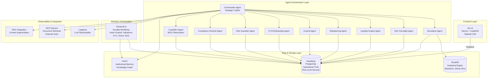
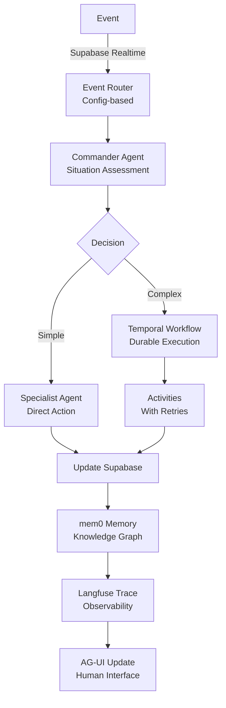

# Evergreen Dragon OS

[](https://github.com/DealExMachina/evergreen-dragon-os)
[](https://opensource.org/licenses/MIT)
[](https://www.typescriptlang.org/)
[](https://nodejs.org/)
[](https://pnpm.io/)

**Research project exploring AI-native architectures for evergreen and ELTIF 2.0 fund management. A full-stack operating system that transforms boutique fund managers into institutional-grade operations through autonomous agent orchestration, durable workflows, and continuous simulation.**

## The Challenge

Evergreen, ELTIF 2.0, and hybrid alternative vehicles operate at the edge of traditional fund administration. They must reconcile continuous subscriptions and redemptions with illiquid underlying assets, precise quarterly valuations, multi-layer regulatory regimes (ELTIF, AIFMD, MiCA, SFDR), and boutique-sized teams expected to match institutional-grade governance. Legacy tooling fragments the stack into siloed spreadsheets, outsourced administrators, and opaque service providers—making it impossible to react to shocks or prove compliance in real time.

## The Vision

Evergreen Dragon OS is built as a **digital twin of the fund**. Every asset, cashflow, liquidity ladder, and regulatory constraint is lifted into an agentic, stateful environment that can think, simulate, and act continuously. Agents reason across Supabase operational truth, DuckDB analytical simulations, mem0 institutional memory, and Temporal workflows to orchestrate the entire lifecycle of the portfolio: onboarding, valuation, liquidity management, compliance, and communication with PMs.

By pairing a Copilot-grade UX with industrial-grade automation, the system gives boutique managers hedge-fund-class leverage without the headcount. The Commander Agent synthesizes complex telemetry into human decisions, while specialized agents execute, monitor, and document every action.

## Why This Matters

| Dimension            | Today's Status Quo           | Evergreen Dragon OS                          |
| -------------------- | ---------------------------- | -------------------------------------------- |
| Liquidity Governance | Manual gates, lagging data   | Real-time ladders, automated throttles       |
| Valuations           | Quarterly, spreadsheet-based | Continuous DuckDB sims + Temporal workflows  |
| Compliance           | Reactive, outsourced         | Embedded, auditable, self-serve evidence     |
| Decision Support     | Fragmented dashboards        | Commander agent with mem0 context            |
| LP Experience        | Static PDF reports           | Live AG-UI copilots + narrative explanations |

**Value Proposition:**

- **80% automation** of recurring risk, liquidity, and compliance processes
- **Regulatory confidence** through Temporal audit trails and mem0 reasoning logs
- **Liquidity mastery** via continuous stress-testing and tokenized liquidity extensions
- **Institutional memory** that persists beyond individual PMs or admins
- **Differentiated client experience** with natural-language explanations and command actions

## Full-Stack Architecture

This is a complete, production-grade architecture spanning frontend, backend, agents, workflows, and data layers:



## Core Components

### Agent Mesh (Mastra Framework)

Nine specialized agents orchestrated through Mastra with RAG and MCP integration:

- **Commander**: Strategic copilot synthesizing telemetry into recommendations
- **Simulation**: DuckDB-powered valuations and stress testing
- **NAV Oversight**: Validation and stale data detection
- **Liquidity Engine**: ELTIF redemption logic and gating
- **Rebalancing**: Allocation adjustments and deployment throttling
- **Unwind**: Illiquid asset sales and settlement coordination
- **KYC/Onboarding**: AML, eligibility, and document extraction
- **Risk Guardian**: Continuous monitoring and VaR limit enforcement
- **Compliance Sentinel**: ELTIF/AIFMD/MiCA policy enforcement
- **CryptoBro**: MiCA-compliant tokenized liquidity operations

### Durable Workflows (Temporal.io)

Long-running operations with retries, compensation, and observability:

- Asset Unwind Workflow
- Quarterly Valuation Workflow
- Stress Test Workflow
- KYC Workflow
- Tokenized Liquidity Workflow

### Operational Data Layer (Supabase)

PostgreSQL with row-level security, realtime subscriptions, and RPC functions. Stores assets, flows, liquidity ladders, compliance events, and workflow metadata.

### Analytical Engine (DuckDB)

Embeddable OLAP database for valuation models, yield curves, liquidity risk trees, ESG factors, and intraday stress testing.

### Institutional Memory (mem0)

Knowledge graph capturing scenarios, playbooks, PM preferences, and anomaly patterns. Enables continuity: "What worked last time we had +150bps shock?"

### Human Interface (AG-UI + CopilotKit)

Next.js frontend with live dashboards, chat/voice interfaces, and action launchers tied to Temporal workflows. Provides transparency and natural-language interaction.

## Robust Architecture Principles

### 1. Dependency Injection

All agents receive typed `AgentContext` with config, logger, and clients. No global singletons. Activities use `withActivityContext()` for memoized dependencies. This ensures testability and composability.

### 2. Event-Driven Design

Supabase Realtime broadcasts trigger agent responses. Event routing configured via `config.agentRouting`, not hardcoded. Enables dynamic composition and extension.

### 3. Type Safety Throughout

Strict TypeScript, Zod schemas for runtime validation, Prisma for database types. End-to-end type safety from database to frontend.

### 4. Modular & Composable

Intentional separation of concerns: Temporal for workflows, Mastra for agents, Supabase for data, DuckDB for analytics. Each component can be extended or replaced independently.

### 5. Observability First

Langfuse traces all agent operations. Structured logging via shared logger. Temporal provides workflow visibility. Risk Guardian and Compliance Sentinel monitor agent behavior.

### 6. Security & Quality

Pre-commit hooks with dependency scanning, ESLint security rules, comprehensive test suite, and CI/CD automation.



## Tech Stack

**Full-Stack Implementation:**

- **Frontend**: Next.js 16, React 19, CopilotKit, Tailwind CSS 4
- **Backend**: Node.js 20+, TypeScript 5.9, pnpm workspaces
- **Agents**: Mastra framework with RAG and MCP integration
- **Workflows**: Temporal.io for durable, auditable operations
- **Database**: Supabase (PostgreSQL) + DuckDB (analytics)
- **Memory**: mem0 knowledge graph
- **Observability**: Langfuse for LLM tracing
- **Validation**: Zod 4.x for runtime schemas
- **ORM**: Prisma for type-safe database access
- **Infrastructure**: Pulumi for IaC, Infisical for secrets
- **Testing**: Vitest with comprehensive unit test suite
- **Quality**: ESLint security plugins, pre-commit hooks, CI/CD

## Research Goals

This project investigates:

1. **AI-First Fund Management**: How can autonomous agents transform evergreen fund operations?
2. **Digital Twin Architecture**: Can we create a complete digital representation of fund operations?
3. **Institutional Memory**: How does knowledge persistence improve decision-making over time?
4. **Regulatory Compliance**: Can AI-native systems provide better auditability than traditional systems?
5. **Human-AI Collaboration**: What's the optimal balance between automation and human oversight?

## Getting Started

```bash
# Clone the repository
git clone https://github.com/DealExMachina/evergreen-dragon-os.git
cd evergreen-dragon-os

# Install dependencies
pnpm install

# Generate Prisma client
pnpm --filter @evergreen/supabase-client prisma generate

# Run tests
pnpm test

# Run security checks
pnpm security:check

# Start development
pnpm dev
```

See [docs/infra_setup.md](docs/infra_setup.md) for complete infrastructure setup.

## Documentation

Comprehensive documentation covering all aspects of the system:

- **[Overview](docs/00_overview.md)** - Executive narrative, value proposition, and strategic positioning
- **[Architecture](docs/01_architecture.md)** - System design, data architecture, and component interactions
- **[Data Model](docs/02_data_model.md)** - Operational and analytical schemas
- **[Event System](docs/03_event_system.md)** - Event-driven architecture and simulation loops
- **[Agent PRDs](docs/04_agents/)** - Detailed specifications for each agent
- **[Engineering Principles](docs/ENGINEERING_PRINCIPLES.md)** - Development guidelines and patterns
- **[Testing Strategy](tests/TESTING_STRATEGY.md)** - Testing approach and architecture-respecting patterns
- **[Security Checks](docs/SECURITY_CHECKS.md)** - Security scanning and best practices

## Contributing

We welcome contributions from researchers, developers, and fund management professionals. This is a research project exploring the future of AI-native fund operations.

**Why Contribute?**

- Explore cutting-edge AI agent architectures
- Work with production-grade tools (Temporal, Mastra, Supabase)
- Contribute to open-source financial technology
- Shape the future of fund management operations

**How to Contribute:**

1. Fork the repository
2. Review [Engineering Principles](docs/ENGINEERING_PRINCIPLES.md) and [Testing Strategy](tests/TESTING_STRATEGY.md)
3. Create a feature branch
4. Ensure pre-commit hooks pass (linting, type-check, tests, security)
5. Submit a pull request

The `main` branch is protected; all changes require review. See [CONTRIBUTING.md](CONTRIBUTING.md) for detailed guidelines.

## Quality Assurance

- **Pre-commit Hooks**: Automatic linting, formatting, type-checking, dependency scanning, and security checks
- **CI/CD**: GitHub Actions runs tests, type checks, and security audits on every push
- **Code Quality**: ESLint with security plugins, SonarJS rules, strict TypeScript
- **Testing**: Comprehensive unit test suite with Vitest, following architecture-respecting patterns
- **Documentation**: Extensive docs covering architecture, agents, events, and workflows

## License

MIT License - see [LICENSE](LICENSE) for details.

## Acknowledgments

Built with exceptional open-source tools:

- [Temporal](https://temporal.io/) - Durable workflow orchestration
- [Mastra](https://mastra.ai/) - Agent framework with RAG and MCP
- [Supabase](https://supabase.com/) - Backend infrastructure and realtime
- [DuckDB](https://duckdb.org/) - Analytical database
- [mem0](https://mem0.ai/) - Institutional memory and knowledge graphs
- [Langfuse](https://langfuse.com/) - LLM observability
- [CopilotKit](https://copilotkit.ai/) - AI copilot framework
- [Next.js](https://nextjs.org/) - React framework
- [Prisma](https://www.prisma.io/) - Database toolkit
- [Zod](https://zod.dev/) - Schema validation
- [Pulumi](https://www.pulumi.com/) - Infrastructure as code

## Organization

Maintained by [DealExMachina](https://github.com/DealExMachina) - Hands on Decentralized Cloud, web3, AI.

---

## Project Status

**Version**: 0.0.1  
**Status**: Research project. Not production-ready. Use at your own risk.

**Current Focus:**

- Core agent implementations (Commander, Simulation, NAV, Liquidity, KYC)
- Temporal workflow definitions
- Testing infrastructure and patterns
- Security and code quality tooling

**Research Questions:**

- How do AI agents improve fund operations decision-making?
- What's the optimal architecture for autonomous fund management?
- How does institutional memory enhance operational continuity?
- Can AI-native systems provide superior regulatory compliance?

**Roadmap:**

- Complete all agent implementations
- Integration testing across components
- Performance optimization and scaling
- Production hardening and security audit
- Real-world pilot deployments

---

**This is a research project pushing the boundaries of AI-native fund management. Join us in exploring how autonomous systems can transform evergreen fund operations.**
