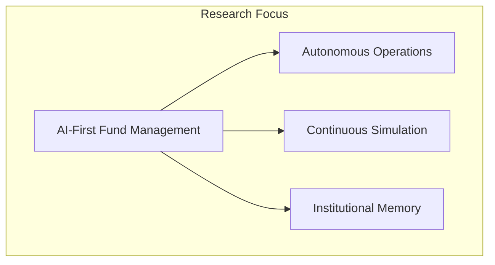
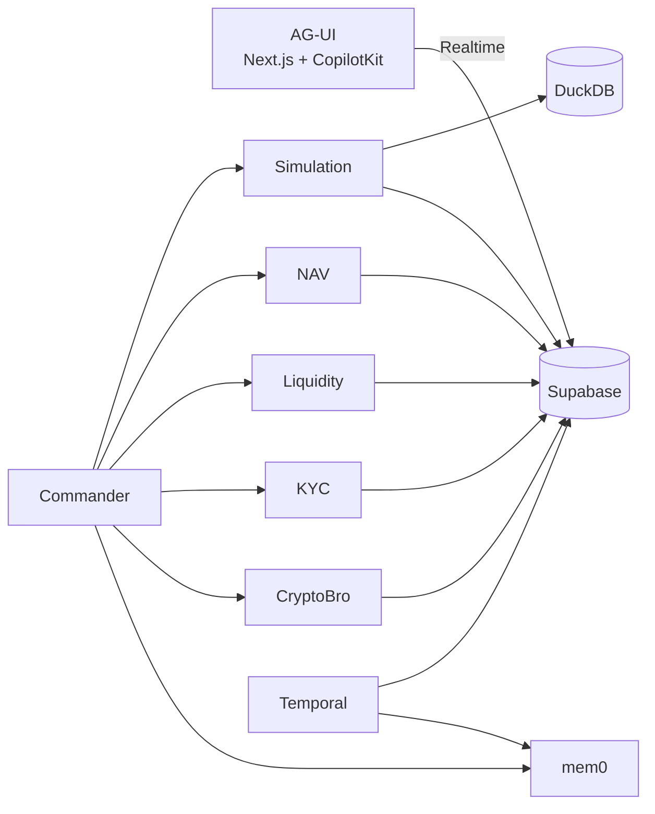
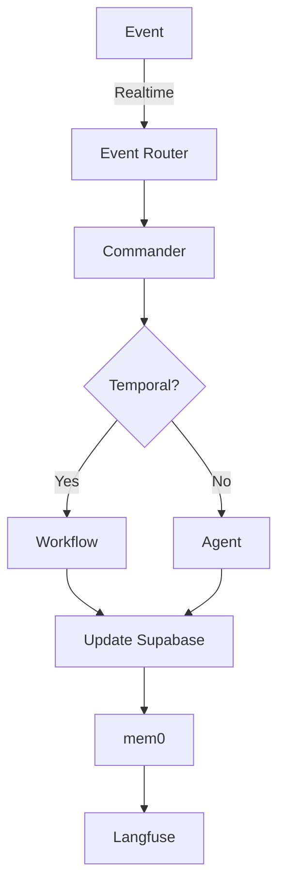

# Evergreen Dragon OS

[](https://github.com/DealExMachina/evergreen-dragon-os)
[](https://opensource.org/licenses/MIT)
[](https://www.typescriptlang.org/)
[](https://nodejs.org/)
[](https://pnpm.io/)

Research project exploring AI-native architectures for evergreen and ELTIF 2.0 fund management. Full-stack operating system enabling boutique managers to operate at institutional scale through autonomous agent orchestration, durable workflows, and continuous simulation.

## Problem

Evergreen funds must reconcile continuous subscriptions/redemptions with illiquid assets, precise valuations, and multi-layer regulatory regimes (ELTIF, AIFMD, MiCA, SFDR) using boutique-sized teams. Legacy tooling fragments operations into siloed spreadsheets and opaque service providers, making real-time response and compliance proof impossible.

## Solution

Digital twin of fund operations. Every asset, cashflow, and regulatory constraint lifted into an agentic environment that simulates, monitors, and orchestrates continuously. Agents reason across Supabase operational truth, DuckDB analytics, mem0 institutional memory, and Temporal workflows.



## Architecture

Modular full-stack: Temporal for durable workflows, Mastra for agent orchestration, Supabase for operational data, DuckDB for analytics, mem0 for knowledge graphs.



## Design Choices

**Dependency Injection**: Typed `AgentContext`, no global singletons. Activities use `withActivityContext()`.

**Event-Driven**: Supabase Realtime triggers agent responses. Routing via `config.agentRouting`.

**Type Safety**: Strict TypeScript, Zod validation, Prisma types.

**Observability**: Langfuse traces, structured logging, Temporal visibility.



## Tech Stack

Node.js 20+, TypeScript 5.9, Temporal.io, Mastra, Supabase, DuckDB, mem0, Langfuse, Next.js, CopilotKit, Zod 4.x, Prisma, Pulumi.

## Getting Started

```bash
pnpm install
pnpm --filter @evergreen/supabase-client prisma generate
pnpm test
pnpm dev
```

See [docs/infra_setup.md](docs/infra_setup.md) for infrastructure.

## Documentation

- [Overview](docs/00_overview.md) - Executive narrative
- [Architecture](docs/01_architecture.md) - System design
- [Data Model](docs/02_data_model.md) - Schemas
- [Event System](docs/03_event_system.md) - Event-driven architecture
- [Agent PRDs](docs/04_agents/) - Agent specifications
- [Engineering Principles](docs/ENGINEERING_PRINCIPLES.md) - Guidelines
- [Testing Strategy](tests/TESTING_STRATEGY.md) - Test patterns

## Contributing

Fork, create branch, ensure pre-commit hooks pass, submit PR. `main` branch protected. See [CONTRIBUTING.md](CONTRIBUTING.md).

## License

MIT - see [LICENSE](LICENSE).

## Acknowledgments

Temporal, Mastra, Supabase, DuckDB, mem0, Langfuse, CopilotKit, Next.js, Prisma, Zod, Pulumi.

## Organization

[DealExMachina](https://github.com/DealExMachina)

---

**Status**: Research project v0.0.1. Not production-ready.
